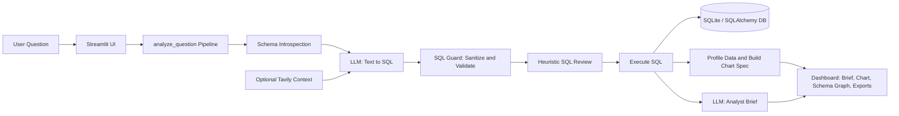
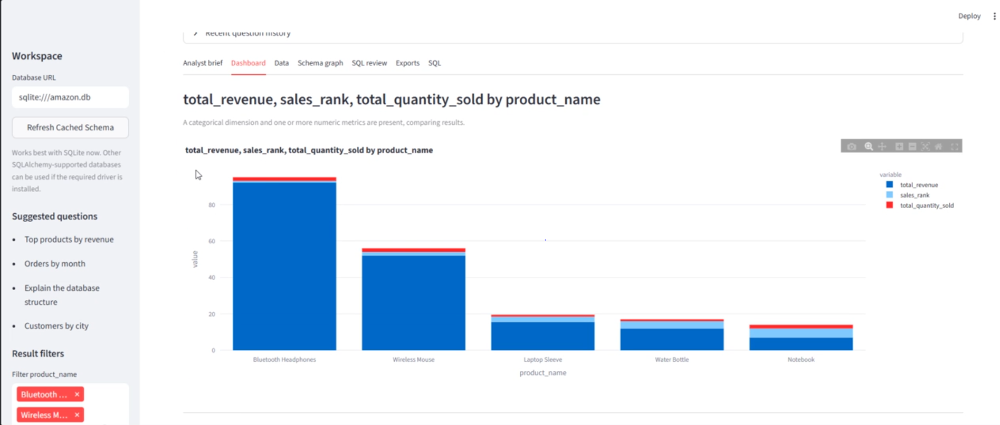
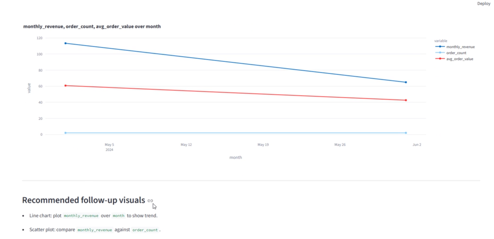
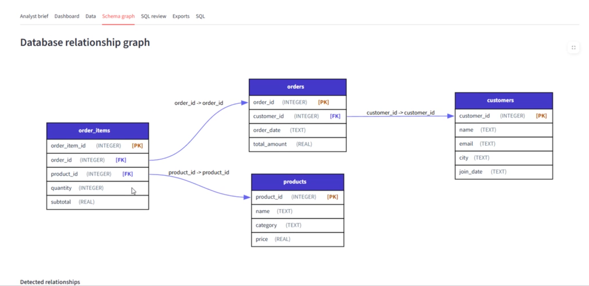

# Data Seeker

Ask a data question in plain English and get back a validated SQL query, the query results, a chart-ready visualization spec, and a senior-analyst-style written brief — all in one Streamlit workspace.

**This pipeline runs two separate LLM calls, not one:**
1. A **SQL-generation model** (`OPENROUTER_MODEL`, default `deepseek/deepseek-v4-flash`, `temperature=0`) turns the schema + your question into a single `SELECT` statement — see `services/sql_generator.py`.
2. An **analyst-writer model** (`OPENROUTER_ANALYST_MODEL`, default `google/gemma-4-31b-it:free`, `temperature=0.3`) takes the executed query's results and rewrites them into the structured Markdown brief — see `services/analyst_writer.py`.

They're configured independently — separate model env vars, separate optional API keys (`OPENROUTER_ANALYST_API_KEY` falls back to `OPENROUTER_API_KEY` if unset) — so you can pair a cheap/fast model for SQL generation with a stronger model for the written brief, or vice versa.

> ⚠️ **Known issue — charts can render incorrectly.** See [Known chart-rendering bug](#known-chart-rendering-bug) below.

## Features
- Natural language → SQL using an OpenRouter-hosted LLM, generated deterministically (`temperature=0`)
- Character-level SQL sanitizer + validator: only single `SELECT` statements are allowed, with a blocklist covering `INSERT`, `UPDATE`, `DELETE`, `DROP`, `ALTER`, `PRAGMA`, `ATTACH`, `CREATE`, and more
- Heuristic SQL review that checks whether the generated query actually matches the question's intent (ranking → `ORDER BY`/`LIMIT`, trend → `GROUP BY`, average → `AVG()`, etc.)
- Automatic schema introspection (tables, columns, types, primary/foreign keys) via SQLAlchemy, cached in memory per database URL
- Interactive schema relationship graph rendered with Graphviz/NetworkX, right inside the dashboard
- Automatic data profiling (numeric / categorical / datetime columns) and chart-type selection — line, bar, scatter, KPI metric, or table — rendered with Plotly
- Second-pass "analyst writer" LLM call that rewrites raw results into a structured Markdown brief (Direct answer, Executive summary, Key findings, Dashboard recommendations, Next questions), with a deterministic fallback if the call fails
- Optional Tavily web search enrichment to give the SQL-generation model extra context for ambiguous questions
- History-aware follow-up context: recent questions/queries are fed back into the next SQL generation call
- Column filters, and CSV / Markdown / JSON export of any result, from the Streamlit UI
- Simple Python API: `analyze_question(prompt)` / `get_data_from_database(prompt)`

## Tech Stack
- Python 3.11–3.13
- SQLite by default (`amazon.db`, a bundled demo store/products/orders dataset), with SQLAlchemy for portability to other databases
- OpenRouter Chat Completions API (via the `openai` SDK) for both the SQL-generation and analyst-writing models
- Streamlit for the dashboard UI
- Plotly for charts, Graphviz + NetworkX for the schema graph, Pandas for data shaping
- Tavily Search API (optional)
- `uv` for dependency management and running the app

## Architecture & Implementation Flow

Everything is coordinated by `analyze_question()` in `services/pipeline.py`, which calls out to each service in sequence.



## Project structure
```text
Data-Seeker-main/
├── frontend.py                  # Streamlit dashboard: query box, tabs, filters, exports
├── main.py                      # Thin public API: analyze_question, get_data_from_database
├── create_database.py           # Builds the bundled amazon.db demo dataset
├── amazon.db                    # SQLite demo database (customers, products, orders, order_items)
├── services/
│   ├── pipeline.py              # Orchestrates the full question -> answer flow
│   ├── database.py              # Schema introspection, caching, Graphviz DOT generation, SQL execution
│   ├── sql_generator.py         # Builds the prompt and calls the OpenRouter SQL model (+ optional Tavily context)
│   ├── sql_guard.py             # Cleans model output and validates/sanitizes SQL before execution
│   ├── sql_review.py            # Heuristic check that SQL matches the question's inferred intent
│   ├── chart_builder.py         # Profiles the result set and picks a chart type/spec
│   ├── analyst_writer.py        # Second LLM call that writes the Markdown analyst brief
│   ├── exporters.py             # Builds CSV / Markdown / JSON export payloads
│   ├── types.py                 # Shared dataclasses (QueryResult, ChartSpec, DataProfile, SQLReviewResult)
│   └── config.py                # Reads environment variables, sets defaults
├── pyproject.toml
├── uv.lock
└── .env.example
```

## Prerequisites
- Create OpenRouter credentials at [OpenRouter](https://openrouter.ai/)
- Optional: create a Tavily API key at [Tavily](https://tavily.com/)
- `amazon.db` is already included; regenerate it any time with `uv run python create_database.py`

## Setup (UV)
No need to manually create a virtual environment — `uv` handles it.

```bash
# Install dependencies from pyproject.toml
uv sync

# Run the Streamlit app
uv run streamlit run frontend.py
```

## Environment Variables

Copy `.env.example` to `.env` and fill in your own values. The app loads `.env` automatically via `python-dotenv`:

```env
DATABASE_URL=sqlite:///amazon.db
OPENROUTER_BASE_URL=https://openrouter.ai/api/v1
OPENROUTER_MODEL=deepseek/deepseek-v4-flash
OPENROUTER_API_KEY=your_openrouter_api_key
OPENROUTER_ANALYST_API_KEY=your_second_openrouter_api_key
OPENROUTER_ANALYST_MODEL=google/gemma-4-31b-it:free

TAVILY_API_KEY=your_tavily_api_key
USE_TAVILY_FOR_SQL_CONTEXT=false
```

Notes:
- `OPENROUTER_API_KEY` is required for SQL generation. `OPENROUTER_ANALYST_API_KEY` is optional — the analyst-writer step falls back to `OPENROUTER_API_KEY` if it isn't set.
- `DATABASE_URL` defaults to `sqlite:///amazon.db`.
- `TAVILY_API_KEY` and `USE_TAVILY_FOR_SQL_CONTEXT` are both optional; Tavily is only called when a key is present **and** the flag is `true`.

To add a new dependency:
```bash
uv add package_name
```

To upgrade dependencies:
```bash
uv lock --upgrade
uv sync
```

## Usage
Python API example:
```python
from main import analyze_question

result = analyze_question("Show revenue by category")
print(result["answer_markdown"])
print(result["visual_spec"])
```

`get_data_from_database(prompt)` is a convenience wrapper that runs the full pipeline and returns just the raw rows.

Run the dashboard UI:
```bash
uv run streamlit run frontend.py
```

The sidebar lets you point at a different `DATABASE_URL` and clear the cached schema. The main panel has tabs for the analyst brief, dashboard chart, raw data, schema graph, SQL review, exports, and the generated SQL itself.

### Switching Models
Edit your environment instead of the code:
```env
OPENROUTER_MODEL=openai/gpt-4.1-mini
OPENROUTER_ANALYST_MODEL=anthropic/claude-3.5-sonnet
```

### SQL Safety
Generated SQL passes through a two-stage check in `services/sql_guard.py` before it ever touches the database:
1. A character-by-character scanner strips SQL comments and neutralizes string literals so keyword matching can't be fooled by text inside a quoted string.
2. The cleaned query must start with `SELECT`, must not contain a semicolon (no multi-statement SQL), and must not contain any blocklisted keyword — `INSERT`, `UPDATE`, `DELETE`, `DROP`, `ALTER`, `PRAGMA`, `ATTACH`, `DETACH`, `CREATE`, `REPLACE`, `TRUNCATE`, `GRANT`, `REVOKE`, `EXEC`, `EXECUTE`.

On top of that, `services/sql_review.py` runs a separate heuristic pass that flags (without blocking) queries that don't match the apparent intent of the question — e.g. a "top 10" question with no `ORDER BY`/`LIMIT`, or a "trend" question with no `GROUP BY`.

### Dashboard Behavior
The Streamlit app:
- Renders a chart automatically based on the shape of the result (`chart_builder.py` picks line/bar/scatter/metric/table)
- Renders a schema relationship graph via `st.graphviz_chart`, built from the introspected foreign keys
- Keeps the last 3 questions/queries as follow-up context for the next SQL generation call
- Lets you filter low-cardinality categorical columns in the sidebar
- Exports the current result as CSV, Markdown, or JSON
- Shows the heuristic SQL review (issues + strengths) alongside the generated query

### Visualization Stack
- Data charts: `Plotly`
- Schema relationships: `NetworkX` (graph structure) + `Graphviz` (rendering, via `st.graphviz_chart`)
- `Altair` is listed as a dependency but is not currently used for rendering — Plotly is used throughout the dashboard

## Performance Tips
- Use faster OpenRouter models for snappier responses
- Keep `temperature=0` on the SQL model for deterministic output
- Schema extraction is cached per `database_url` in-process (`services/database.py`); use the "Refresh Cached Schema" sidebar button after changing the underlying data
- Only enable Tavily enrichment when you actually need it — it adds a network round trip before SQL generation

## Troubleshooting
| Issue | Cause | Fix |
|-------|-------|-----|
| Long response time | Model latency or Tavily enrichment enabled | Switch to a faster model or set `USE_TAVILY_FOR_SQL_CONTEXT=false` |
| SQL errors (no such column) | Model hallucinated a column/table | Ask a more specific question, or inspect the Schema graph tab |
| `ValueError: Unsafe SQL detected` | Generated SQL touched a blocked keyword or wasn't a single `SELECT` | Rephrase the question; this is the guard working as intended |
| Empty results | Query valid but no matching rows | Inspect `amazon.db` (or your `DATABASE_URL`) contents |
| OpenRouter authentication error | Invalid or missing key | Check `OPENROUTER_API_KEY` (and `OPENROUTER_ANALYST_API_KEY` if set) |
| Analyst brief looks generic | Analyst LLM call failed silently | `analyst_writer.py` falls back to a templated summary on any exception — check your analyst model/key |
| Tavily request failed | Invalid key or network issue | Set `USE_TAVILY_FOR_SQL_CONTEXT=false` or check `TAVILY_API_KEY` |

## Known chart-rendering bug

Charts sometimes render wrong (misordered x-axis, a date/time field plotted as a plain category, or a blank figure) even though the SQL and the chosen chart type are correct. Root cause, found in `frontend.py` vs `services/chart_builder.py`:

- **Backend** (`chart_builder.profile_dataframe`) converts columns to proper dtypes before deciding on a chart — numeric via `pd.to_numeric`, dates via `pd.to_datetime` — and picks x/y/color and chart type based on *that converted* dataframe.
- **Frontend** (`frontend.to_dataframe`) rebuilds the dataframe straight from the raw SQL result rows (`pd.DataFrame(result["rows"], columns=result["columns"])`) with **no dtype conversion**, and it's this raw, unconverted `filtered_df` that actually gets passed into `render_chart()` / `px.line` / `px.bar` / `px.scatter`.

So the chart *spec* (e.g. "this is a datetime axis, use a line chart") can be right while the dataframe Plotly actually receives still has that same column as plain text — which is what produces the bad plots.

**Workaround until fixed:** re-run `chart_builder.profile_dataframe()` (or at minimum `pd.to_datetime`/`pd.to_numeric` on the relevant columns) on `filtered_df` in `frontend.py` before calling `render_chart`, so the dataframe's dtypes match what the spec assumed.

## Limitations
- **Single-database, in-memory schema cache**: the schema cache lives in process memory (capped at 50 entries), so it resets on restart and isn't shared across processes.
- **Chart selection is heuristic**: `chart_builder.py` picks a chart type from column types and naming patterns; it can pick a suboptimal chart for unusual or heavily nested result shapes.
- **SQL guard is keyword/regex-based, not a full parser**: it neutralizes comments and string literals before matching blocklisted keywords, which covers common injection patterns but isn't a substitute for running against a read-only database role in production.
- **SQLite is the only database exercised by the bundled demo**; other SQLAlchemy-supported databases should work but require installing the relevant driver yourself.

## Roadmap / Ideas
- Add a persistent (cross-process) caching layer for schema reads and common questions
- Add drill-down interactions that regenerate SQL from chart selections
- Add automated tests for SQL validation and schema extraction
- Add bundled drivers/setup instructions for Postgres and DuckDB

## Demo / Screenshots

<details>
<summary>🖼️ Click to view screenshots</summary>





</details>

<details>
<summary>🎥 Click to view demo video</summary>

<video src="https://github.com/Areshi001/Data-Seeker/raw/main/assets/DataSeeker.mp4" controls width="100%"></video>
*Data Seeker in action — natural language to SQL, charts, and analyst brief*

</details>

---

## Security Notes

Executing LLM-generated SQL is inherently risky even with the guard in place. For anything beyond local/demo use, run the app against a database user with read-only permissions, and treat the keyword blocklist as a second line of defense, not the only one.

## Contributing
1. Fork & branch
2. Make changes
3. Run `uv sync && uv run python -m py_compile main.py`
4. Submit PR

## License
MIT (adjust in `pyproject.toml` if you choose a different one)

---

